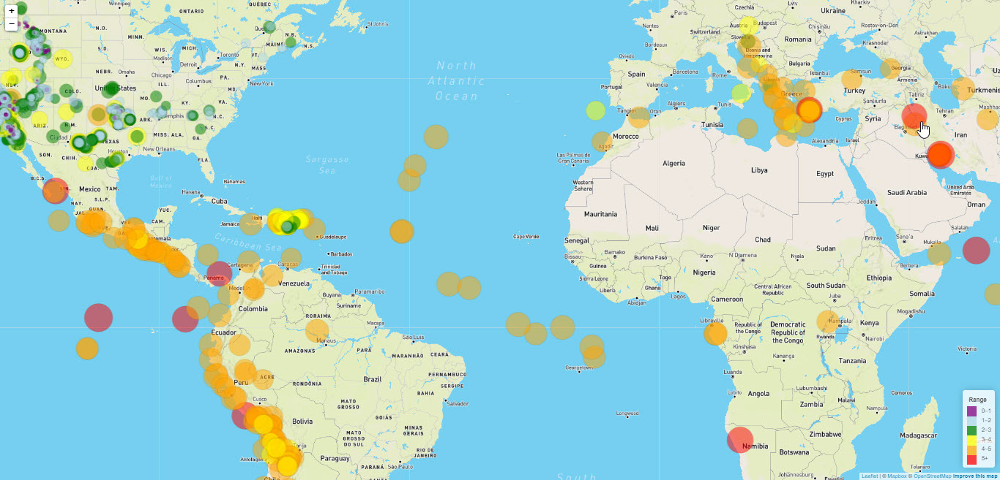

# Visualizing Data with Leaflet

## Background

The USGS is responsible for providing scientific data about natural hazards, the health of our ecosystems and environment; and the impacts of climate and land-use change. Their scientists develop new methods and tools to supply timely, relevant, and useful information about the Earth and its processes.

The task involved is to build new set of tools that will allow them to visualize their earthquake data and allow them to better educate the public and other government organizations (and hopefully secure more funding..) on issues facing our planet.

### Level 1: Basic Visualization

The first task is to visualize an earthquake data set. The USGS provides earthquake data in a number of different formats, updated every 5 minutes. The dataset was obtained in the [USGS GeoJSON Feed](http://earthquake.usgs.gov/earthquakes/feed/v1.0/geojson.php) page, for visualization. When the dataset is selected, it will give a JSON representation of that data. The URL of this JSON is used to pull the data for our visualization. The 'then' method is used for the promise to retrieve the data with D3.

A map is created using Leaflet that plots all of the earthquakes from your data set based on their longitude and latitude. The data markers reflect the magnitude of the earthquake by their size and depth of the earth quake by color. Earthquakes with higher magnitudes appear larger and earthquakes with greater depth appear darker in color. The popups are included that provide additional information about the earthquake when a marker is clicked. A legend is created that will provide context for the map data. 

### Level 2 : More Data

The second plot includes the second data set on the map to illustrate the relationship between tectonic plates and seismic activity. The second data set is pulled in and visualized alongside the original set of data. Data on tectonic plates was found at found at, <https://github.com/fraxen/tectonicplates>. The base maps are added to choose from as well as separate out the two different data sets into overlays that can be turned on and off independently. The layer controls is also added to the map.